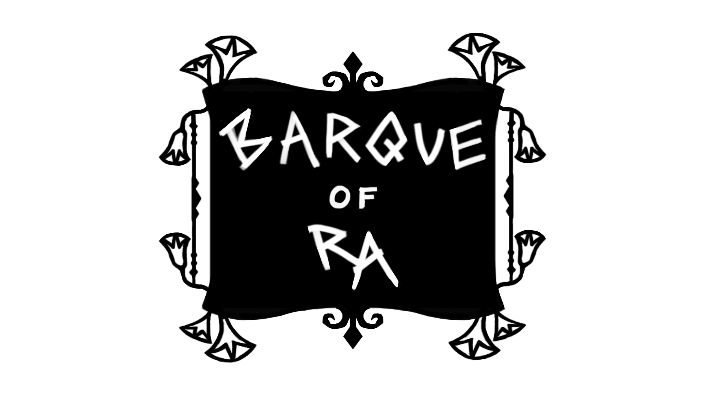

# Barque of Ra

**Barque of Ra is a 3D tower defense game, where you invest souls that are passengers in your barque to summon defenders against beasts of the underworld that attack you in waves.**

This [Unity](https://unity.com/) game was created as part of the second semester project at [S4G School for Games](https://www.school4games.net/) in 10 weeks, from June to September 2025.

[Download it from itch.io!](https://s4g.itch.io/barque-of-ra)

## Contributions

Engineering consisted of two people, my colleague Gerald took care of the overall game framework, the UI and the barque, while my focus was on player and enemy units, their AI and the game's architecture. The project had a bit of a troubled development unfortunately due to absences, including myself at critical phases. The resulting code does not really reflect my quality standards, so with more experience in Unity and the advantage of hindsight I took some time after the project was finished to re-implement a tiny part of the game. This experiment can be found [here](https://github.com/FuzzyHerbivore/ExperimentOfRa) and shows how I applied a similar approach to modularization as in [Yokai Parade](https://github.com/FuzzyHerbivore/yokai-parade).

